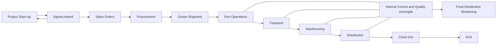

# Polygon Hackathon

## Environment Setup;

            *Solidity*
            npm install -g solc
            
            *Truffle*
            npm install -g truffle
                    truffle version
                    
            *Ganache*
            Download Package from https://www.trufflesuite.com/ganache

## Aid transparency project

Key Points;

   - Donation
   - Transportation
   - Storage
   - Distribution
     
# USAID Program Award details 

## Step 1: Donor Actions  

1. Identify funding priorities and allocate funds for development assistance programs in Kenya.
2. Develop funding guidelines and requirements for potential grantees.
3. Release a Request for Application (RFA) to potential grantees.
4. Review submitted applications and select grantees.
5. Negotiate and finalize grant agreements with selected grantees.
6. Disburse funds to grantees as specified in the grant agreement.
7. Monitor and evaluate the grantee's performance and progress toward program goals.
8. Provide technical assistance and support to grantees as needed.
9. Close out the grant, including final reporting and evaluation of the program's impact. 

### Donor Timeline (approximate)  

| Step | Approximate Days | Stakeholders                          |
|------|------------------|---------------------------------------|
| 1    | 30               | Donor                                 |
| 2    | 15               | Donor                                 |
| 3    | 30               | Donor                                 |
| 4    | 60               | Donor, Grantee                        |
| 5    | 30               | Donor, Grantee                        |
| 6    | 30               | Donor, Grantee                        |
| 7    | Ongoing          | Donor, Grantee, Independent Evaluator |
| 8    | Ongoing          | Donor, Grantee                        |
| 9    | 30               | Donor, Grantee                        |

## Step 2: Award-Requesting Entity Actions  

1. Review the RFA and eligibility criteria to determine if the organization is qualified to apply.
2. Develop a proposal that meets the funding guidelines and requirements.
3. Submit the proposal to the donor by the specified deadline.
4. Participate in negotiations with the donor to finalize the grant agreement.
5. Implement the program according to the grant agreement and submit regular reports to the donor.
6. Purchase products using the funds and distribute aid to beneficiaries.
7. Monitor and evaluate program implementation and report progress to the donor.
8. Close out the grant, including final reporting and evaluation of the program's impact.  

### Award-Requesting Entity Timeline (approximate)  

| Step | Approximate Days | Stakeholders                   |
|------|------------------|--------------------------------|
| 1    | 15               | Award-Requesting Entity        |
| 2    | 30               | Award-Requesting Entity        |
| 3    | 30               | Award-Requesting Entity        |
| 4    | 30               | Award-Requesting Entity, Donor |
| 5    | Ongoing          | Award-Requesting Entity, Donor |
| 6    | Ongoing          | Award-Requesting Entity, Donor |
| 7    | Ongoing          | Award-Requesting Entity, Donor |
| 8    | 30               | Award-Requesting Entity, Donor |

Note that these timelines and stakeholders are approximate and may vary depending on the specific circumstances of each grant.

## Step 3: Awarding the Contract

1. Once the bids have been received, they are reviewed to ensure compliance with the RFP.
2. The technical and financial proposals are evaluated and scored against the evaluation criteria outlined in the RFP.
3. Based on the evaluation, a selection committee recommends the most responsive and responsible bidder for the contract award.
4. Negotiations begin with the selected bidder to finalize the terms and conditions of the contract.
5. Once the negotiations are complete, the contract is awarded to the selected bidder.

### Step 3: Timeline (approximate)

| Step | Approximate Days | Stakeholders                        |
|------|------------------|-------------------------------------|
| 1    | 10-20            | Procurement team                    |
| 2    | 30-60            | Procurement team, Technical Experts |
| 3    | 15-30            | Selection Committee                 |
| 4    | 30-45            | Procurement team, Legal Team        |
| 5    | 5-10             | Procurement team, Selected Bidder   |

## Step 4: Contract Management  
1. Establish a contract management team to oversee the implementation of the contract.
2. Develop a contract management plan outlining the roles and responsibilities of the contract management team, communication protocols, and performance metrics.
3. Monitor contract compliance and performance against the contract management plan.
4. Conduct regular performance reviews and provide feedback to the contractor.
5. Ensure that all required deliverables are submitted by the contractor on time and meet the quality standards specified in the contract.
6. Manage any changes or modifications to the contract, including negotiating and executing change orders as necessary.
7. Identify and manage any risks or issues that arise during contract implementation.
8. Close out the contract, including final acceptance of deliverables and resolution of any outstanding issues.

### Step 4 Timeline (approximate)

| Step | Approximate Days | Stakeholders             |
|------|------------------|--------------------------|
| 1    | 1-2              | Procurement team         |
| 2    | 10-20            | Contract management team |
| 3    | Ongoing          | Contract management team |
| 4    | Ongoing          | Contract management team |
| 5    | Ongoing          | Contract management team |
| 6    | 15-30            | Contract management team |
| 7    | Ongoing          | Contract management team |
| 8    | 10-20            | Contract management team |

## Step 5: Disbursement and Fund Management

1. Once the contract is in place, funds are disbursed to the contractor according to the payment schedule outlined in the contract.
2. The contract management team monitors the use of funds to ensure compliance with the contract and program requirements.
3. The contractor submits financial reports and supporting documentation to the contract management team to account for the use of funds.
4. The contract management team reconciles the financial reports against the payment schedule to ensure accurate and timely disbursement of funds.
5. The contract management team tracks the status of funds and any outstanding commitments or obligations.

### Step 5 Timeline (approximate)

| Step | Approximate Days | Stakeholders                           |
|------|------------------|----------------------------------------|
| 1    | As per contract  | Finance team, Contractor               |
| 2    | Ongoing          | Contract management team               |
| 3    | Monthly          | Finance team, Contractor               |
| 4    | Monthly          | Finance team, Contract management team |
| 5    | Ongoing          | Finance team, Contract management team |

## Step 6: Procurement and Distribution of Products

1. The contractor procures the products and services required by the program according to the procurement plan outlined in the contract.
2. The products and services are delivered to the program-implementing partners in Kenya.
3. The program implementing partners distribute the products and services to the intended beneficiaries, such as individuals or organizations in need.

### Step 6 Timeline (approximate)
| Step | Approximate Days | Stakeholders                         |
|------|------------------|--------------------------------------|
| 1    | As per contract  | Contractor, Procurement team         |
| 2    | 30-60            | Contractor, Logistics team, Partners |
| 3    | Ongoing          | Partners                             |

## Step 7: Monitoring and Evaluation
1. The program implementing partners monitor the distribution of products and services to ensure that they reach the intended beneficiaries.
2. The program implementing partners collect data on the use and impact of the products and services.
3. The data is analyzed and used to evaluate the effectiveness of the program and inform future program design and implementation.
### Step 7 Timeline (approximate)

| Step | Approximate Days | Stakeholders                 |
|------|------------------|------------------------------|
| 1    | Ongoing          | Implementing partners, USAID |
| 2    | Ongoing          | Implementing partners, USAID |
| 3    | 60-90            | Implementing partners, USAID |
